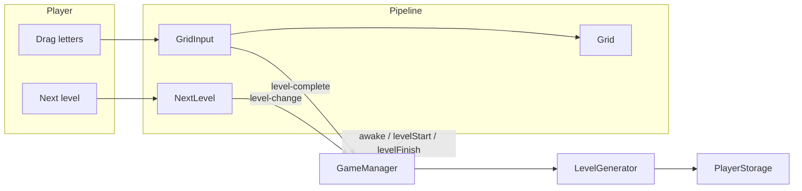

# Maze Of Words

## Introduction

Maze Of Words is a 2D FillWord puzzle game where you need to find one big word in a level grid

Built with Cocos Creator 3.8.8. The target platform is web (Yandex Games)

## Architecture

Gameplay is orchestrated as a **level pipeline**, not a web of hard-coded managers

### Ownership

- **GameManager** — boots the game, listens for level events, advances progress, and calls pipeline hooks in order. It should stay thin: no feature-specific UI logic
- **Pipeline features** — optional `awake` / `levelStart` / `levelFinish` on `PipelineComponent`. New systems (coins, hints, SDK UI) should plug in here and register on the scene pipeline list
- **Level generation** — pure-ish factory: pick a word for the locale/index, build a path scheme on a grid, cache the current level in player storage so reloads resume mid-progress
- **Events** — features announce outcomes (`level-complete`, `level-change`, …) via bubbling Cocos events; the manager translates them into pipeline phases
- **Persistence** — typed `StorageValue` keys for progress. Safe under empty/corrupt localStorage so editor script loading never crashes
- _**self contained**_ — helpers that **must not depend on game-specific files**

### Runtime loop

1. Load dictionaries for the active locale from the `bundle` asset pack
2. Create or restore the current level, then `levelStart` across the pipeline (rebuild grid, reset input)
3. Player traces adjacent cells; submit evaluates `correct`/`bonus`/`wrong` word with short feedback tweens
4. `correct` word → `levelFinish` (lock play, reveal next). Next button → bump index, clear current cache, start again

### Project layout

| Location                      | Purpose                                      |
| ----------------------------- | -------------------------------------------- |
| `assets/code/`                | Game scripts and pipeline                    |
| `assets/code/self contained/` | Reusable engine wrappers                     |
| `assets/node/`                | Scene and prefabs (editor-owned wiring)      |
| `assets/bundle/`              | Game resources that are downloaded as needed |
| `.cursor/rules/`              | Guidance for Cursor agents                   |

## TODO

- add coins
- add hint
- add language change
- add Yandex Games SDK

## Agent notes

Cursor rules under `.cursor/rules/` describe pipeline conventions, Cocos pitfalls, and what is safe to edit. Prefer those over memorizing class APIs; when behavior changes, update the **flow** sections above rather than method lists
