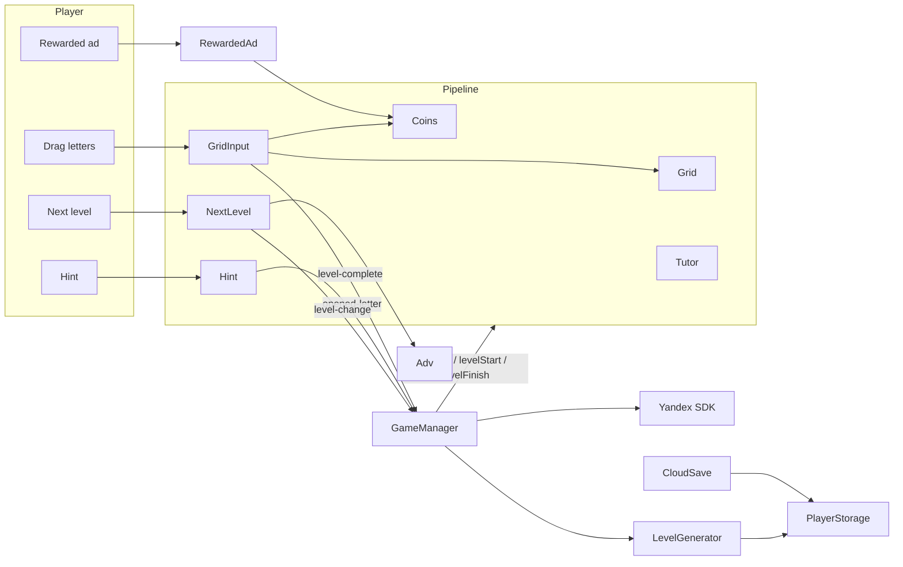

# Maze Of Words

## Introduction

Maze Of Words is a 2D FillWord puzzle: find one main word on a letter grid. Extra dictionary words of 4+ letters are optional bonuses.

Built with Cocos Creator 3.8.8. The target platform is web (Yandex Games).

## Architecture

Gameplay is orchestrated as a **level pipeline**, not a web of hard-coded managers.

### Ownership

- **GameManager** — boots SDK/config/cloud, listens for level events, advances progress, posts the `level` leaderboard score, and calls pipeline hooks in order. It should stay thin: no feature-specific UI logic
- **Pipeline features** — optional `awake` / `levelStart` / `levelFinish` on `PipelineComponent`. New systems plug in here and register on the scene pipeline list. Peers may listen to each other via editor-wired references and `Delegate`s; they must not import `GameManager`
- **Level generation** — pick a word for the locale/index using `Config.levelProgression` (least-used length in the band, avoid repeating the previous length). Build a grid path that prefers a different start cell than the last level. Cache the current level **per locale** so language switches restore open letters / bonuses. `prevLevels` and `lenToWordIndexes` keep variety across levels
- **Events** — features announce outcomes via bubbling Cocos events (`level-complete`, `level-change`, `opened-letter`); the manager translates them into pipeline phases
- **Persistence** — typed `StorageValue` keys for progress (safe under empty/corrupt localStorage). `CloudSave` mirrors localStorage ↔ Yandex `player.getData` / `setData` on a short push loop
- **Platform (Yandex Games)** — `index.ejs` loads the SDK; `Yandex.ts` waits for globals or installs an editor mock, reports game ready, and tracks gameplay pause/resume. `Config` holds Remote Config–overridable constants. `Adv` shows fullscreen interstitials with `Config.interCooldown`. The footer button shows a rewarded video and grants `Config.rewardedCoins`. Authorized players submit `leaderboards.setScore("level", displayedLevel)`
- **Popups / end buttons** — `PopupManager` + `Popup` subclasses; `RevealButton` base for Next / Definition show-hide
- **Audio** — pipeline `Audio` plays SFX and shuffles the `music` bundle; volumes live in storage; Yandex `game_api_pause` mutes
- _**self-contained**_ — helpers that **must not depend on game-specific files**

### Runtime loop

1. Init Yandex SDK (or mock), pull cloud saves and remote config; use the Yandex language until the player picks one in settings (`langChosen`)
2. Load dictionaries for the active locale from the `words` asset bundle; start shuffled BGM from the `music` bundle
3. Create or restore the current level for that locale, then `levelStart` across the pipeline; report game ready, gameplay start, and leaderboard score. If every letter is already hinted, complete immediately
4. `Tutor` traces the word on the first two levels (toast on level 1), explains bonuses on level 5, retraces through level 5 after bursts of wrong words, and points at the rewarded button if a hint is tapped with no coins
5. Player traces adjacent cells; submit evaluates `correct` / `bonus` / `wrong` with short feedback (arrows + colors). First-time `correct` / `bonus` flies `Config.correctCoins` / `Config.bonusCoins` into the header. Hint spends `Config.hintCost` (coins fly to the cell). The footer ad button plays a rewarded video and flies `Config.rewardedCoins` the same way
6. Main word **or** every letter hinted → `levelFinish` (lock play, reveal next / definition if Wiktionary is reachable). Next → stash this locale’s current level as previous, bump index, clear the current cache, maybe show a fullscreen ad, post the new score, start again
7. Language change → keep in-progress levels per locale, reload for the new language

### Project layout

| Location | Purpose |
| --- | --- |
| `assets/code/` | Game scripts and pipeline |
| `assets/code/level/` | Grid, input, generator, next-level button |
| `assets/code/self-contained/` | Reusable engine / SDK wrappers |
| `assets/node/` | Scene and prefabs (editor-owned wiring) |
| `assets/level/words/` | Dictionaries (`words` bundle): `words_all_{locale}.txt` |
| `assets/level/converter.py` | Offline rebuild of those lists (Wiktionary dumps + wordfreq) |
| `assets/media/music/` | Background tracks (`music` bundle) |
| `build-templates/web-mobile/` | Web shell + Yandex SDK bootstrap |
| `.cursor/rules/` | Guidance for Cursor agents |

## TODO

- analytics
- leaderboard view (score is already submitted)

## Agent notes

Cursor rules under `.cursor/rules/` describe pipeline conventions, Cocos pitfalls, and what is safe to edit (no `.meta` / scene / prefab edits unless asked). Prefer those over memorizing class APIs; when behavior changes, update the **flow** sections above rather than method lists.
