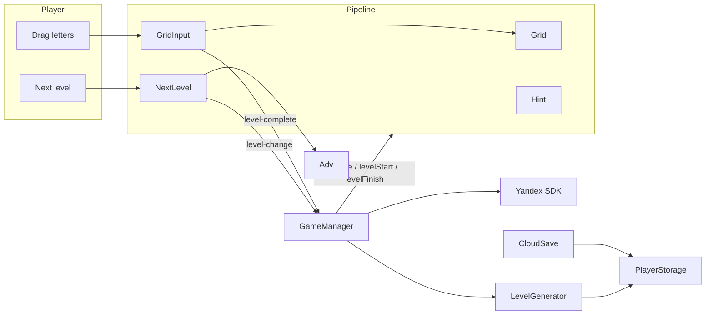

# Maze Of Words

## Introduction

Maze Of Words is a 2D FillWord puzzle game where you need to find one big word in a level grid

Built with Cocos Creator 3.8.8. The target platform is web (Yandex Games)

## Architecture

Gameplay is orchestrated as a **level pipeline**, not a web of hard-coded managers

### Ownership

- **GameManager** — boots SDK/config/cloud, listens for level events, advances progress, and calls pipeline hooks in order. It should stay thin: no feature-specific UI logic
- **Pipeline features** — optional `awake` / `levelStart` / `levelFinish` on `PipelineComponent`. New systems plug in here and register on the scene pipeline list
- **Level generation** — pick a word for the locale/index using `Config.levelProgression`, build a path scheme, cache the current level **per locale** so language switches restore open letters / bonuses
- **Events** — features announce outcomes (`level-complete`, `level-change`, hint letter events, …) via bubbling Cocos events; the manager translates them into pipeline phases
- **Persistence** — typed `StorageValue` keys for progress (safe under empty/corrupt localStorage). `CloudSave` mirrors localStorage ↔ Yandex `player.getData` / `setData`
- **Platform (Yandex Games)** — `index.ejs` loads the SDK; `Yandex.ts` waits for globals or installs an editor mock, reports game ready, and tracks gameplay pause/resume. `Config` holds Remote Config–overridable constants. `Adv` shows fullscreen interstitials with `Config.interCooldown`. The footer button shows a rewarded video and grants `Config.rewardedCoins`
- **Popups / end buttons** — `PopupManager` + `Popup` subclasses; `RevealButton` base for Next / Definition show-hide
- _**self contained**_ — helpers that **must not depend on game-specific files**

### Runtime loop

1. Init Yandex SDK (or mock), pull cloud saves and remote config; use the Yandex language until the player picks one in settings (`langChosen`)
2. Load dictionaries for the active locale from the `bundle` asset pack
3. Create or restore the current level for that locale, then `levelStart` across the pipeline; report game ready and gameplay start. `Tutor` traces the word on the first two levels, retraces through level 5 after some wrong words, and points at the rewarded button if a hint is tapped with no coins
4. Player traces adjacent cells; submit evaluates `correct` / `bonus` / `wrong` with short feedback (arrows + colors). First-time `correct` / `bonus` flies `Config.correctCoins` / `Config.bonusCoins` into the header counter. The footer ad button plays a rewarded video and flies `Config.rewardedCoins` the same way
5. `correct` word → `levelFinish` (lock play, reveal next / definition if wiki is reachable). Next → bump index, clear this locale’s current cache, maybe show a fullscreen ad, start again
6. Language change → keep in-progress levels per locale (empty caches may be dropped), reload for the new language

### Project layout

| Location                         | Purpose                                      |
| -------------------------------- | -------------------------------------------- |
| `assets/code/`                   | Game scripts and pipeline                    |
| `assets/code/self contained/`    | Reusable engine / SDK wrappers               |
| `assets/node/`                   | Scene and prefabs (editor-owned wiring)      |
| `assets/bundle/`                 | Dictionaries and downloadable game resources |
| `build-templates/web-mobile/`    | Web shell + Yandex SDK bootstrap             |
| `.cursor/rules/`                 | Guidance for Cursor agents                   |

## TODO

- remove debug `PlayerStorage.clearAll()` in `GameManager.onLoad` before release

## Agent notes

Cursor rules under `.cursor/rules/` describe pipeline conventions, Cocos pitfalls, and what is safe to edit (no `.meta` / scene / prefab edits unless asked). Prefer those over memorizing class APIs; when behavior changes, update the **flow** sections above rather than method lists
